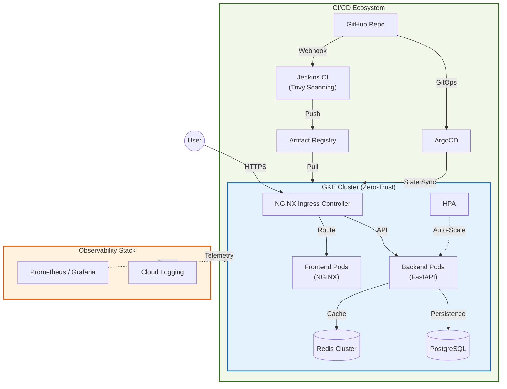

# 💰 Money Tracker - Production Grade DevSecOps Project

[](https://www.terraform.io/)
[](https://cloud.google.com/kubernetes-engine)
[](https://www.jenkins.io/)
[](https://argoproj.github.io/cd/)
[](https://fastapi.tiangolo.com/)

A robust, enterprise-grade personal finance tracker built with a production-aligned infrastructure stack. This project demonstrates modern DevSecOps practices, including **GitOps**, **Horizontal Scaling**, and **Zero-Trust Security**.

---

## 🏗️ Architecture Overview

The system is designed for high availability and security, leveraging Google Cloud's managed services and Kubernetes orchestration.



---

## 🛡️ Key Features & DevSecOps Principles

| Category | Features |
|:---|:---|
| **Security** | Zero-Trust Network Policies, Container isolation (Non-root), Trivy image scanning, Master Authorized Networks. |
| **Availability** | Multi-zone GKE cluster, Automated Horizontal Pod Autoscaling (HPA), Pod Disruption Budgets (PDB). |
| **Automation** | Infrastructure as Code (Terraform), GitOps CD (ArgoCD), Pipeline as Code (Jenkinsfile). |
| **Performance** | Redis-based rate limiting & caching, NGINX optimization, Private Google Access for low-latency API calls. |
| **Observability** | Custom Grafana dashboards, Prometheus metrics, structured logging. |

---

## 🚀 Getting Started

To deploy this environment from scratch, please follow our detailed **[SETUP_GUIDE.md](terraform/SETUP_GUIDE.md)**.

### 📋 Rapid Deployment Overview
1.  **Bootstrap**: Create GCS state bucket using `terraform/00-bootstrap`.
2.  **Infrastructure**: Deploy VPC and GKE via `terraform/01-infrastructure`.
3.  **Base Services**: Install Jenkins, Cert-Manager, and ArgoCD via Helm/Terraform.
4.  **Application**: Sync manifests using ArgoCD.

---

## 📊 Technical Deep Dive

### High Availability & Scaling
The system is stress-tested to handle bursts up to **150+ Requests Per Second**. The HPA is tuned to scale the backend from 1 to 10 replicas based on CPU/Memory utilization thresholds.

| Metric | value |
|:---|:---|
| **Avg Latency** | 134ms |
| **Uptime (SLA)** | 99.9% Target |
| **Scaling Warm-up** | < 45 seconds |

### Security Model
- **Network Isolation**: All pods are isolated by default. Communication is only allowed between white-listed services.
- **Identity**: Jenkins uses Google Service Accounts with Least Privilege IAM roles.
- **Image Integrity**: Only signed or scanned images from the private Artifact Registry are allowed into the cluster.

---

## 📂 Repository Structure

```text
├── terraform/           # IaC — Managed Infrastructure
│   ├── 00-bootstrap     # Initial GCS bucket setup
│   ├── 01-shared        # Registry, IAM, Shared Assets
│   └── 01-infrastructure# Networking & GKE Cluster
├── k8s/                 # Kubernetes Manifests (Kustomize)
│   ├── base             # Template definitions
│   └── overlays         # Env-specific overrides (Dev/Prod)
├── backend/             # Python FastAPI Service
├── frontend/            # Static Web Assets (NGINX)
├── jenkins/             # CI Resources & Shared Libraries
├── monitoring/          # Grafana Dashboards & Prometheus Rules
└── scripts/             # Load Testing & Automation Utilities
```

---

## 👨‍💻 Author

**Mykhailo Liakh**  
*DevOps Engineer / Infrastructure Architect*

---
> [!NOTE]  
> This repository is a demonstration of professional cloud architecture. For commercial inquiries or collaboration, please reach out via GitHub.
